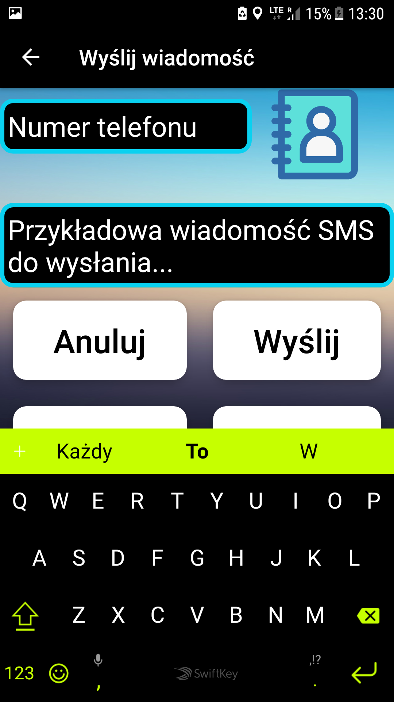
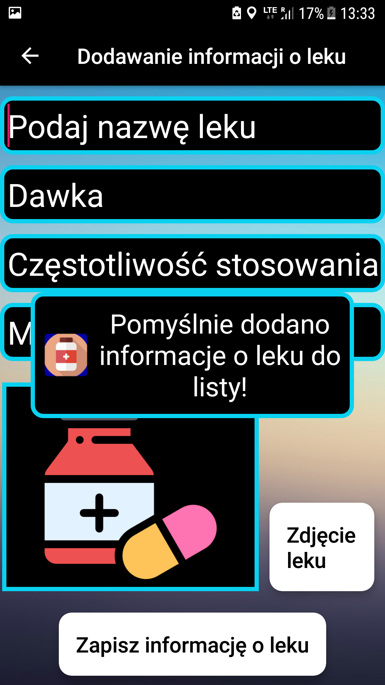
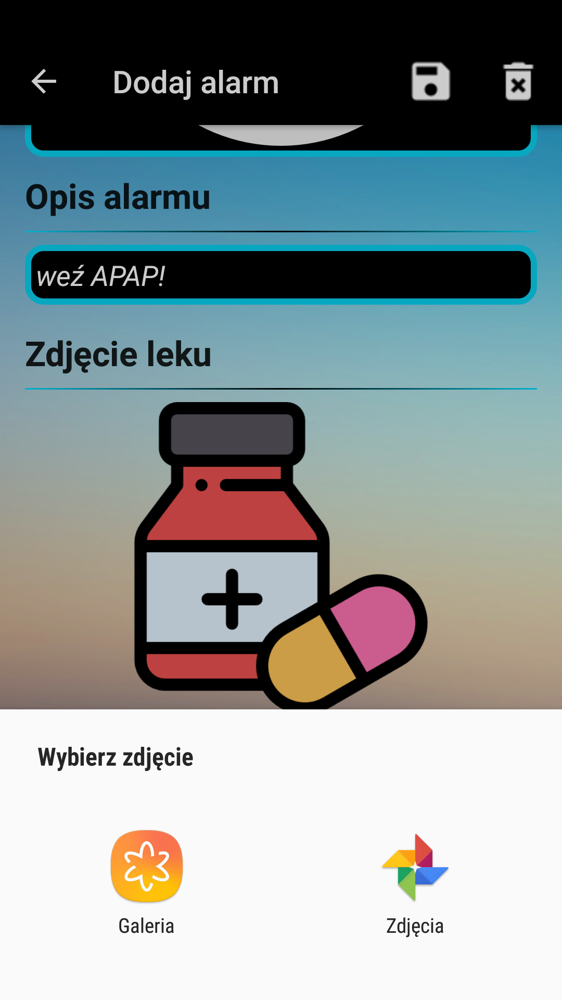
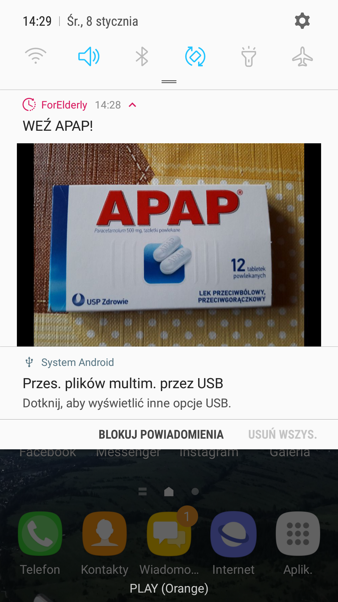

# ForElderly
Postanowiono napisać aplikację mobilną dla osób w podeszłym wieku,
która dzięki swej prostocie będzie ułatwieniem do skorzystania z podstawowych funkcji telefonu.
Co więcej, oprócz ułatwienia dostępu,
aplikacja ma pozwalać na utrzymywanie informacji o lekach
oraz generowaniu przypomnień o ważnych wydarzeniach (np. wizytach u lekarza).
Kluczową funkcją jest możliwość ustawiania alarmów informujących o konieczności przyjęcia kolejnej dawki
danego leku wraz z jego nazwą i zdjęciem.
Alarm generowany jest z dźwiękiem i pojawia się w naszym smartfonie jako powiadomienie nawet,
gdy ekran telefonu jest wyłączony. Pondato alarmy nie są usuwane po wyłączeniu urzędzenia.
Jak wiadomo, ludzie starsi są często bardzo schorowani i przyjmują ogromną ilość medykamentów,
często zapominając o ich regularnym dawkowaniu ze względu na sędziwy wiek i problemy z pamięcią.
Taka aplikacja może być dla nich sporym ułatwieniem i może zachęcić do śmielszego korzystania
ze smartfonów. Bardziej skomplikowane rzeczy, jakie można wykonywać z poziomu aplikacji zaleca się
administratorowi (opiekunowi/rodzinie osoby starszej).
Senior powinien bez problemu nauczyć się wzywać pomoc,
akceptować przyjęcie dawki leku, dzwonić oraz pisać sms pod dowolny numer,
przeglądać listę swoich leków. 

## Technologie
- Java 8
- Android
- SQLite
- Broadcast Receiver
- Intent Service
- Shared Prefernces
- Notifications

## Narzędzia
- Android Studio

# Przedstawienie interfesju aplikacji

## Panel połączeń ratunkowych

## Panel wykonywania dowolnych połączeń

## Panel wysyłania smsów

## Panel informacji o lekach

## Panel ustawień alarmów

## Panel ustawień aplikacji

## Panel logowania

## Panel nawigacyjny

## Styl komunikatów w aplikacji

Aplikacja umożliwia ustawianie logowania z hasłem.

Darmowe ikony pobrano ze strony https://www.flaticon.com/